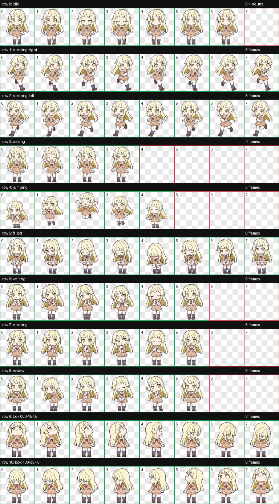

# 弦卷心 / Tsurumaki Kokoro — Codex Pet

一个用于 Codex 的非官方自定义动态宠物。它以《BanG Dream!》中的弦卷心（Tsurumaki Kokoro）为灵感，采用平涂 Q 版角色风格，并包含完整的 11 行 v2 精灵图动画。



## 内容

- 显示名称：`弦卷心`
- 宠物 ID：`tsurumaki-kokoro`
- 精灵图版本：`2`
- 图集：`1536 × 2288` WebP，8 列 × 11 行，单格 `192 × 208`
- 动画：待机、左右斜向跑步、挥手、跳跃、失败、等待、工作、审阅，以及 16 个视线方向

左右跑步均使用完整的 8 帧循环。角色以三分之四视角斜向移动，手臂和腿部交替摆动；左跑由已确认的右跑逐帧镜像而成，因此不会倒放节奏。

## 安装

将 [`pet/`](pet) 整个目录复制到你的 Codex 宠物目录：

```text
%USERPROFILE%\.codex\pets\tsurumaki-kokoro\
```

重启 Codex 或重新加载宠物列表后，选择“弦卷心”。

## 校验

`pet/validation.json` 记录了发布前校验结果：图集为有效的 v2 WebP，尺寸为 `1536 × 2288`，具有透明背景且没有键色边缘残留。

## 致谢与说明

这是非官方粉丝创作的 Codex 宠物资源，与 BanG Dream!、Hello, Happy World! 及其权利人没有官方关联。相关角色名称和原作权利归各自权利人所有。
